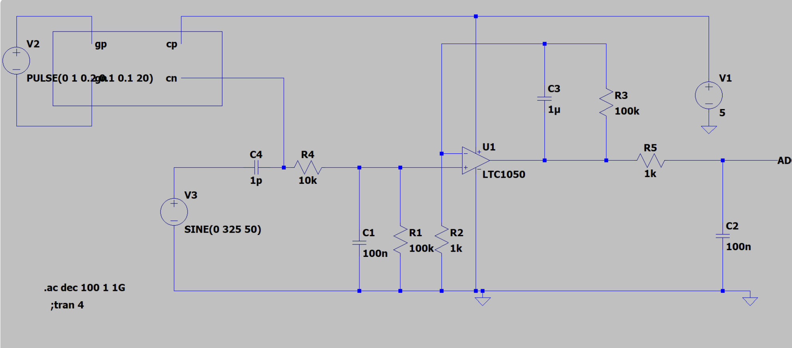
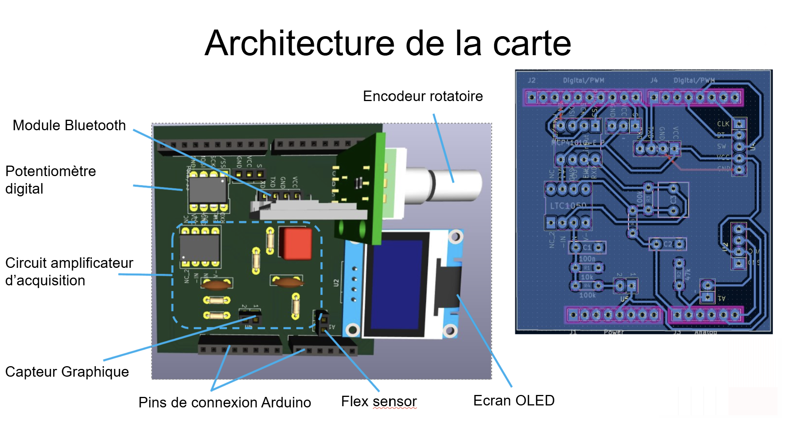
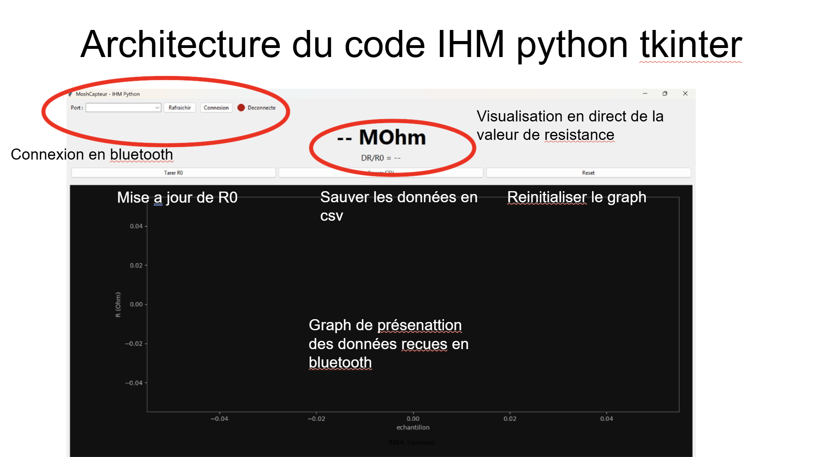
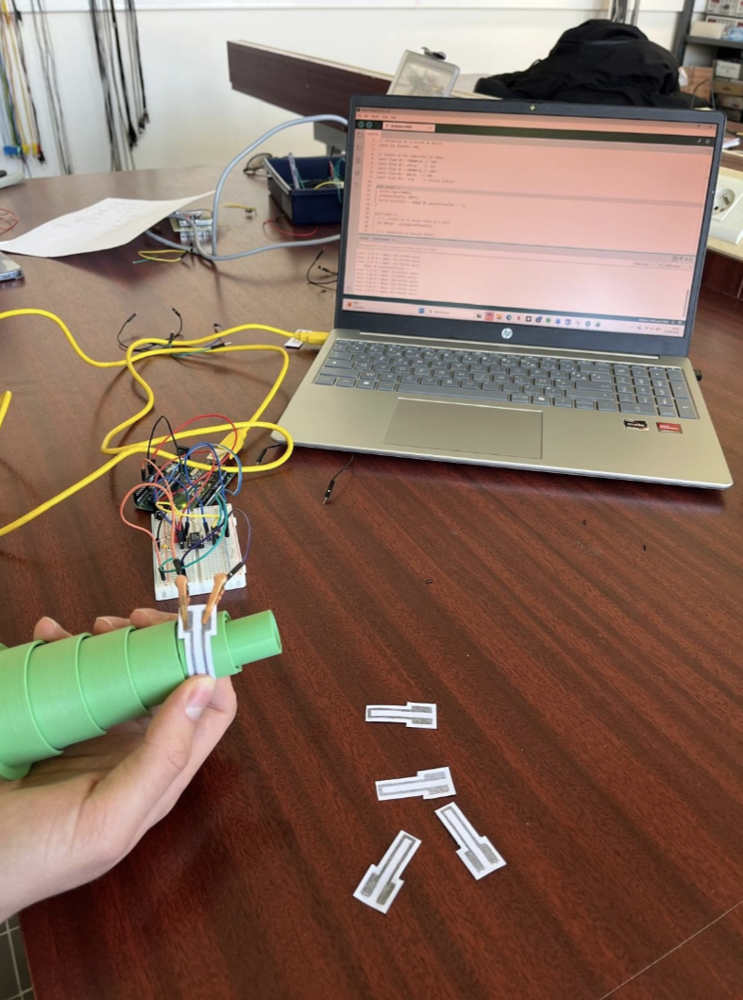
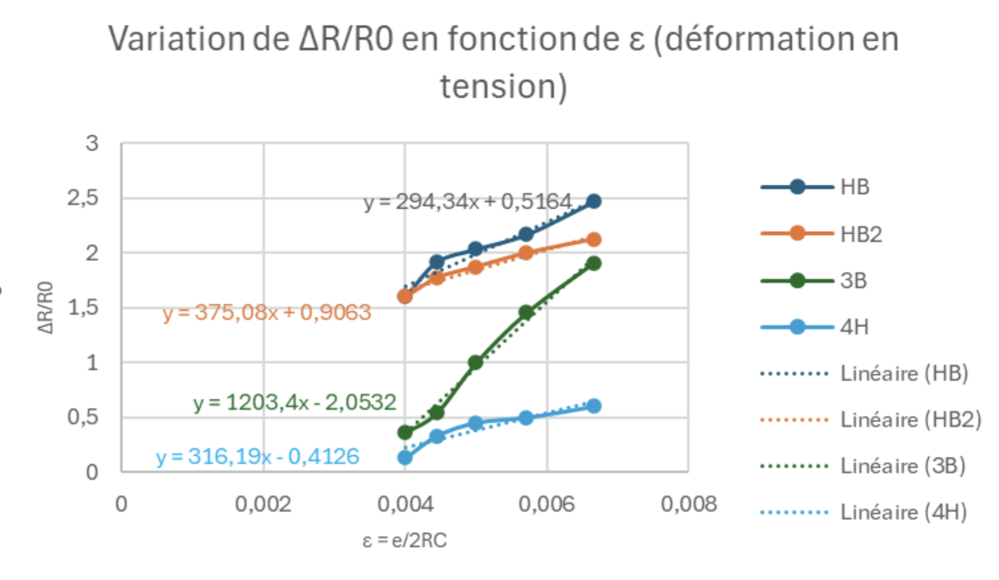

 # Capteur de déformation en graphite - Projet 4GP

  > **Génie Physique - INSA Toulouse - Promotion 2025-2026**
  > UF « Du capteur au banc de test »

  ## Sommaire
  - [Présentation générale](#présentation-générale)
  - [1. Le capteur graphite](#1-le-capteur-graphite)
    - [1.1 Principe physique](#11-principe-physique)
    - [1.2 Objectifs et livrables](#12-objectifs-et-livrables)
    - [1.3 Matériel](#13-matériel)
  - [2. Conditionnement du signal](#2-conditionnement-du-signal)
    - [2.1 Étage transimpédance (LTSpice)](#21-étage-transimpédance-ltspice)
    - [2.2 Modèle mathématique](#22-modèle-mathématique)
  - [3. Carte électronique (shield Arduino)](#3-carte-électronique-shield-arduino)
    - [3.1 Routage sous KiCad](#31-routage-sous-kicad)
    - [3.2 Fabrication et brochage](#32-fabrication-et-brochage)
  - [4. Logiciel embarqué](#4-logiciel-embarqué)
  - [5. Application mobile](#5-application-mobile)
  - [6. Banc de caractérisation](#6-banc-de-caractérisation)
  - [7. Résultats et analyse](#7-résultats-et-analyse)
  - [8. Bilan et perspectives](#8-bilan-et-perspectives)
  - [Remerciements](#remerciements)
  - [Contacts](#contacts)

  ---

  ## Présentation générale

  Ce projet propose une chaîne de mesure complète - acquisition, traitement, affichage et
  archivage des résultats - construite autour d'un capteur de déformation **low-tech** : une simple piste
  de graphite tracée au crayon sur du papier.

  L'ensemble s'appuie sur l'article de **Lin, C.-W., Zhao, Z., Kim, J. et al. (2014)**,
  *« Pencil Drawn Strain Gauges and Chemiresistors on Paper »* (Nature). L'article de
  référence est disponible dans le dépôt.

  On cherche ic à faire un dispositif **bon marché,
  reproductible, réparable et fabricable avec des moyens d'atelier ordinaires**, tout en
  restant exploitable scientifiquement.

  ---

  ## 1. Le capteur graphite

  ### 1.1 Principe physique

  Le capteur est obtenu en frottant un crayon sur une feuille de papier (≈ 0,35 mm
  d'épaisseur). Le graphite s'accroche aux fibres et forme un réseau granulaire : le
  courant circule par les contacts entre grains et par effet tunnel entre particules
  voisines. La résistance du tracé dépend donc directement de la distance entre grains.

  Lorsque le papier est plié, cette distance évolue :

  | Sollicitation | Effet sur le réseau | Résistance |
  |---------------|---------------------|------------|
  | **Traction**  | Les grains s'écartent | **augmente** |
  | **Compression** | Les grains se rapprochent | **diminue** |

  La sensibilité dépend de plusieurs facteurs : dureté de la mine, quantité de graphite
  déposée, géométrie du tracé, humidité et température ambiantes. Différentes duretés ont
  été testées (2H, HB, B, 3B, 4B, 6B) afin de comparer leur comportement.

  ### 1.2 Objectifs et livrables

  L'objectif est de remonter à l'angle de flexion (donc à la déformation) à partir de la
  seule mesure de résistance. Le travail se décompose en cinq étapes : simulation du
  conditionnement analogique, conception du PCB, programmation du microcontrôleur,
  développement de l'application mobile et caractérisation expérimentale.

  Livrables produits :
  - un **shield Arduino** regroupant l'électronique de mesure, d'amplification et de
    communication.
  - un **code Arduino (C++)** organisé en pseudo machine à états (car nous avons essayer mais ce n'est pas réellement une machine à état).
  - une **IHM (interface human machine) en format .py** de supervision et de tracé temps réel.
  - une **datasheet** récapitulant la caractérisation du capteur.

  ### 1.3 Matériel

  **Électronique**
  - Arduino UNO Rev 3
  - Amplificateur opérationnel LTC1050
  - Potentiomètre numérique SPI MCP41010 (10 kΩ, 256 pas)
  - Écran OLED 0,96" SSD1306 (I²C)
  - Encodeur rotatif KY-040
  - Module Bluetooth HC-05
  - Passifs : résistances (2×1 kΩ, 1×10 kΩ, 2×100 kΩ) et condensateurs (2×100 nF, 1×1 µF)
  - Pour comparaison : capteur de flexion commercial (Flex Sensor) + résistance de charge 47 kΩ

  **Fabrication du capteur**
  - Papier souple, crayons de duretés variées, contacts et pinces de test Mueller

  **Logiciels**
  - LTSpice (simulation) · KiCad (PCB) · Arduino IDE (firmware)

  **Banc d'essai**
  - module imprimé en 3D à rayons de courbure étalonnés + instrumentation de mesure. Nous avons réutilisé les système imprimés les années passées pour rester dans la démarche **low-tech**

  ---

  ## 2. Conditionnement du signal

  ### 2.1 Étage transimpédance (LTSpice)

  À vide, le capteur affiche une résistance très élevée (du MΩ au GΩ selon la mine).
  Sous 5 V, le courant traversant n'est que de l'ordre du nanoampère : il faut donc un
  étage d'amplification pour ramener le signal dans la plage 0–5 V de l'ADC de l'Arduino.

  Un montage **transimpédance** autour du LTC1050 a été simulé sous LTSpice afin de valider
  le gain, étudier la réponse en fréquence et dimensionner le filtrage. Trois filtres
  passe-bas améliorent le rapport signal/bruit :

  1. **Entrée (~175 Hz)** — atténue les vibrations et tremblements mécaniques ;
  2. **Rétroaction active (~1,6 Hz)** — coupe le bruit secteur 50 Hz ;
  3. **Sortie (~1,6 kHz)** — supprime les parasites haute fréquence de l'électronique
     numérique.

  

    
     <em>Montage transimpédance autour du LTC1050 simulé sous LTSpice.</em>
  

  ### 2.2 Modèle mathématique

  La tension lue par l'ADC s'écrit :

  $$V_{ADC} = \left(1 + \frac{R_3}{R_2}\right) \cdot \frac{R_1}{R_1 + R_c + R_5} \cdot V_{cc}$$

  ce qui permet au firmware de remonter à la résistance du capteur :

  $$R_c = \left(1 + \frac{R_3}{R_2}\right) \cdot R_1 \cdot \frac{V_{cc}}{V_{ADC}} - R_1 - R_5$$

  La résistance $R_2$ est pilotée dynamiquement par le potentiomètre numérique MCP41010,
  ce qui rend possible l'auto-calibration décrite plus bas.

  ---

  ## 3. Carte électronique (shield Arduino)

  ### 3.1 Routage sous KiCad

  Une fois le montage validé en simulation, le PCB a été dessiné sous KiCad pour se
  brancher directement sur l'Arduino UNO. Il a fallu créer les symboles et empreintes des
  composants absents des bibliothèques standard (Bluetooth, potentiomètre numérique…),
  puis assembler le schéma en respectant les bus **SPI** et **I²C**.

  Le placement a cherché à raccourcir les pistes analogiques et à limiter les couplages.

  

    
     <em>Architecture de la carte : rendu 3D annoté (gauche) et routage du PCB sous KiCad (droite).</em>
  

  ### 3.2 Fabrication et brochage

  Le circuit a été gravé sur plaque époxy cuivrée par **photolithographie**
  (impression du masque, insolation UV, révélation, gravure au perchlorure de fer,
  perçage, soudure). *Merci à Cathy sans qui on serait sans doute encore en train de nous arracher les cheveux sur la carte.*

  Brochage retenu :

  | Composant | Rôle | Interface Arduino |
  |-----------|------|-------------------|
  | LTC1050 | Amplification transimpédance | Entrée analogique `A0` |
  | MCP41010 | Potentiomètre numérique 10 kΩ | SPI (`CS`, `MOSI: D11`, `SCK: D13`) |
  | SSD1306 | Affichage OLED | I²C (`SDA: A4`, `SCL: A5`) |
  | KY-040 | Navigation menu | Interruptions (`CLK: D2`, `DT`, `SW`) |
  | HC-05 | Liaison Bluetooth | SoftwareSerial (`RX`, `TX`) |
  | Flex Sensor | Référence commerciale | Pont diviseur (47 kΩ) |

  Des tests de continuité et de courts-circuits ont suivi l'assemblage. Une première carte
  a dû être reprise : car nous nous étions trompé avec le port qui était nécessaire aux interruptions pour le menu.

  ---

  ## 4. Logiciel embarqué

  Le firmware Arduino orchestre l'ensemble du système au moyen d'une **tentative de code de machine à états**,
  ce qui garantit un enchaînement clair des tâches :

  Fonctions principales : acquisition du signal, calcul de $R_c$, **auto-calibration** de
  la résistance à plat $R_0$ via le MCP41010 (point de repos centré à $V_{cc}/2$),
  affichage OLED, navigation par encodeur (gérée par interruptions) et transmission
  Bluetooth. Le code s'appuie sur les bibliothèques SPI, I²C et série, avec un soin
  particulier porté à la stabilité des mesures.

  ---

  ## 5. Application mobile

  Une application Android développée avec claude code dans un premier temps mais nous nous sommes rendu compte que le code était bine trop complexe pour une app qui reste assez basique. Alors nous nous sommes tournés vers une HIM python car avec nos expériences personnelles nous avions déjà été confronté à ce genre de code python pour assurer la supervision et
  l'archivage des mesures :

  - connexion au module HC-05 (sélection dans la liste, voyant d'état) ;
  - réception cadencée sur un timer de 200 ms (5 Hz) dès que des octets sont disponibles ;
  - tracé temps réel par défilement horizontal sur un `Canvas` ;
  - export des données au format `.txt` (concaténation dans une variable globale, puis
    `SaveFile`).

  L'objectif était de disposer d'une interface simple, utilisable directement pendant les
  essais.

  

    
     <em>IHM Python : connexion HC-05, tracé temps réel et export des mesures.</em>
  

  ---

  ## 6. Banc de caractérisation

  Pour imposer des déformations connues, un **gabarit imprimé en 3D** a été conçu : une
  série de demi-cylindres à rayons de courbure étalonnés. Le capteur, maintenu par des
  pinces de test, y est plaqué dans deux configurations :

  - **Traction** : la piste de graphite est orientée vers l'extérieur → le maillage
    s'étire → $R_c$ augmente.
  - **Compression** : la piste est plaquée contre le cylindre → les feuillets se
    rapprochent → $R_c$ diminue.

  Chaque rayon correspond à un angle de flexion connu, ce qui permet d'étudier la
  sensibilité, la répétabilité et la réponse traction/compression pour plusieurs duretés
  de crayon.

  

    
     <em>Essai en traction : la piste de graphite est orientée vers l'extérieur.</em>
  

  ---

  ## 7. Résultats et analyse

  Les mesures confirment le comportement attendu : **hausse de la résistance en traction,
  baisse en compression**, avec une forte dépendance au type de mine utilisé.

  - Les mines **tendres** (4B, 6B), riches en carbone, donnent une résistance initiale
    faible, une bonne conductivité et une réponse linéaire en compression — mais une faible
    tenue mécanique (perte de matière par frottement).
  - Les mines **plus dures** (B, 3B), plus chargées en liant, partent d'une résistance plus
    élevée et offrent un facteur de jauge supérieur, au prix d'une dérive et
    d'irrégularités caractéristiques des milieux granulaires désordonnés.

  On observe aussi que **la mesure abîme le capteur** : la résistance à plat diffère avant
  et après essai. Les acquisitions ont donc été menées en deux temps (traction puis
  compression), chacune avec sa propre *flat-band resistance*.

  

    
     <em>Courbes R = f(flexion/compression) pour les différentes mines.</em>
  

  ---

  ## 8. Bilan et perspectives

  Le projet valide une **chaîne de mesure complète et connectée**, de la modélisation
  analogique jusqu'à l'application mobile, à partir de matériaux quasi gratuits.

  **Atouts** : coût matière négligeable, éco-conception, accessibilité, bonne réponse en
  traction/compression, faible consommation, capteur réparable sur place en repassant du
  graphite.

  **Limites** : répétabilité modeste (usure du film, contacts des pinces, hystérésis du
  papier) face aux jauges industrielles.

  Le capteur reste **exploitable à condition d'être calibré individuellement** : les
  valeurs absolues varient, mais le comportement relatif sous déformation est cohérent
  après étalonnage.

  Pistes d'amélioration vers un produit viable (capteurs jetables, usage pédagogique) :
  1. **électrodes fixes** imprimées plutôt que des contacts mécaniques ;
  2. **protection** du film par vernis/plastification, et vernis sur le PCB contre
     l'oxydation du cuivre.

  ---

  ## Remerciements

  Merci à l'équipe encadrante pour son accompagnement durant les phases de conception, de
  fabrication et de caractérisation : **J. Grisolia, B. Mestre, A. Biganzoli et
  C. Crouzet** — et tout particulièrement à Cathy Crouzet pour son aide en atelier PCB.

  ## Contacts

  N'hésitez pas à nous écrire pour toute question sur le projet ou les fichiers de
  fabrication :

  - **Ellande FRANCOISE** — `francoise@insa-toulouse.fr`
  - **Clément MAS** — `cmas@insa-toulouse.fr`